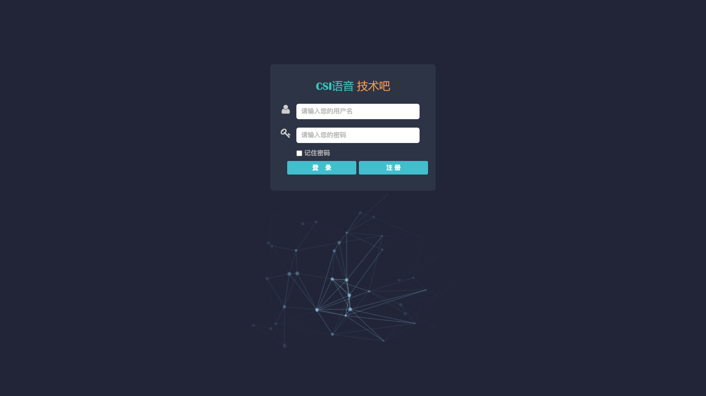
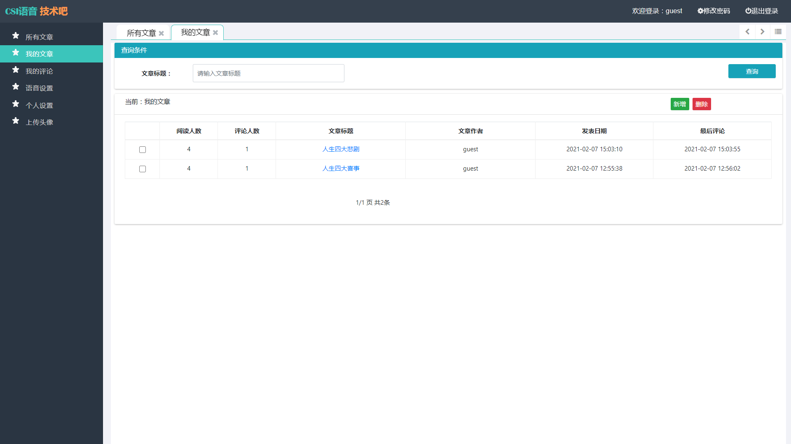
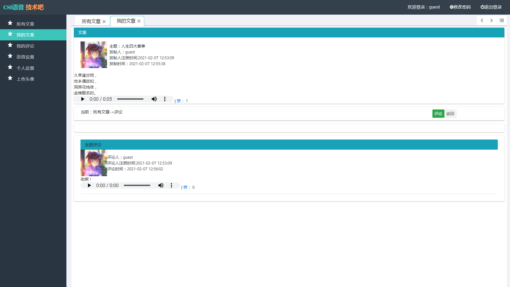
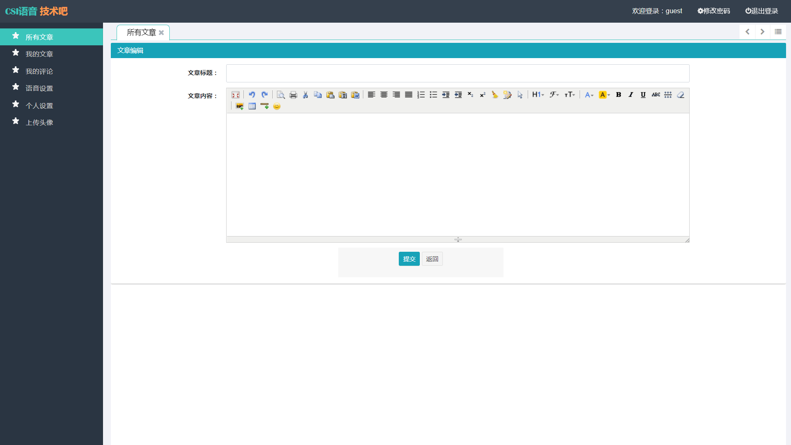
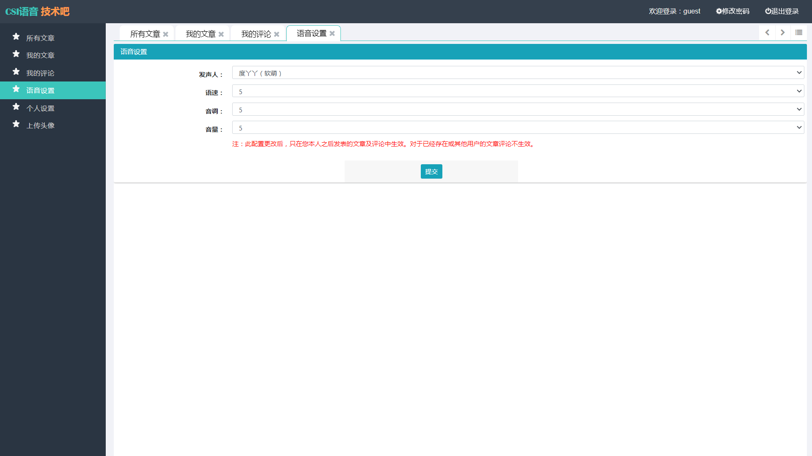
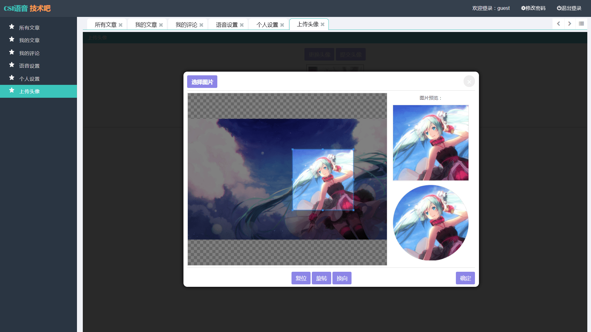
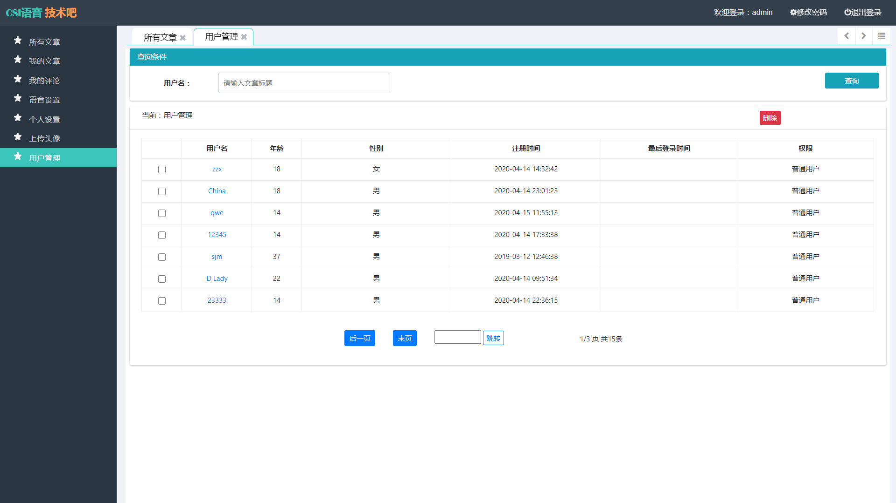

# CSI语音技术吧

#### 介绍
本项目主要利用百度文字转语音 API 接口实现一个简单的语音贴吧网站，提供一个可以分享生活趣事、吐槽代码BUG以及抒发内心苦闷的交流平台。主要功能包括登录注册、文章发表 / 评论 / 点赞 / 查询 / 删除、语音设置、个人设置、头像上传、用户管理等。

#### 链接

CSI语音技术吧：[http://software.yongkj.cn/postbar/](http://software.yongkj.cn/postbar/)
> 账户：guest
> 密码：123456

#### 截图

#### 技术栈

MySQL+Spring+SpringMVC+MyBatis+HTML+CSS+JS+JQuery+Bootstrap3

1.  前端使用了 JQuery 库操作 DOM，采用 Bootstrap3 框架来完成响应式布局
2.  后端则使用SSM 框架（Spring + SpringMVC + MyBatis）来开发
3.  使用百度文字转语音 API 实现文字转语音功能
4.  用户免登录功能使用 session 会话来完成
5.  文章的发表功能主要利用 KindEditor 可视化 HTML 编辑器来实现
6.  后台的数据存储主要采用开源的Mariadb数据库来完成

#### 功能特性

1.  账号登录、注册功能，用户登录之后短时间内无需登录
2.  文章展示功能，可浏览所有发表文章以及个人已发表文章
3.  点赞功能，用户可以对感兴趣的文章或者评论点赞
4.  评论功能，用户也可以在精彩文章下面发表感言
5.  头像上传，支持常见图片格式的图片作为用户头像，展示个性
6.  可对语音的发声、语速、音调以及音量进行调整，获得心意的语音发音

#### 使用说明

1.  post_bar.sql 为数据库备份文件
2.  可在 src/db.properties 文件中修改数据库连接信息
3.  百度语音合成 API 接口信息尚且保留，可直接使用
4.  如需打包部署服务器，则可以使用 Eclipse 打包项目，默认打包为 War 包
